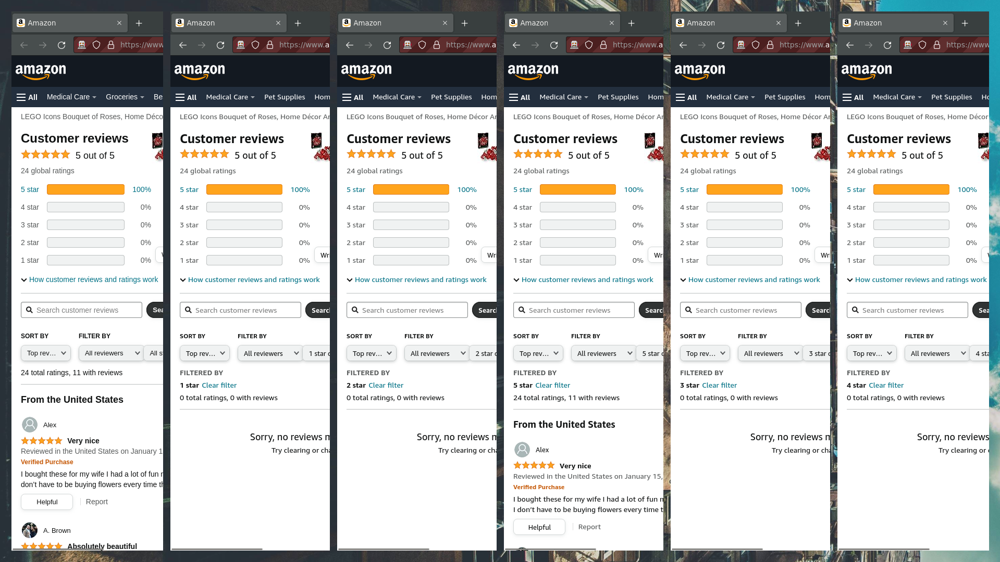

# A parallel screen scraping cookbook

<figure>
  
  <figcaption>Scraping process with headless mode disabled</figcaption>
</figure>

The source code for this is available on GitHub: [https://github.com/ajskateboarder/wordsmyth/tree/minimal/src/crawling](https://github.com/ajskateboarder/wordsmyth/tree/minimal/src/crawling)

Web scraping, particularly for the purpose of building large datasets, is often overlooked when speed is required. I have yet to see a project out in the wild that parallelizes Selenium instances, which is frankly kind of weird since it's what powers a majority of data driven projects and datasets. Like, how did [this dataset](https://jmcauley.ucsd.edu/data/amazon/) come into fruition, which definitely wasn't built from a synchronous web scraper? 

Here, I'm going to explain what I did to build an optimal, parallel screen scraper to aggregate Amazon reviews, and what tools and logic to apply.

Yes, I did look into using [Grid](https://www.selenium.dev/documentation/grid/) before going and building my thing from scratch, and don't really recommend it for scraping -- It's more for testing from the looks of it. Grid seems to rely more on a static configuration, which doesn't work particularly well for a scraper that needs to share state between all nodes (and I mean a lot of state).

## Layout

The end goal of every screen scraping project will obviously vary, but in my project, I intend to do the following on Amazon:

1\. Scrape an initial set of product IDs from links from [best selling](https://amazon.com/gp/bestselling)

2\. Login with given user credentials, hand any CAPTCHAs to user

3\. For every ID
  
- 3a. Collect product data, such as title, price, rating, review proportionality

- 3b. Collect other product IDs from visited pages
  
- 3c. Collect a balanced amount of text reviews for each star category (1 through 5) from each browser, based on mentioned review proportionality
  
- 3d. Pipe above data to a processor

4\. Repeat steps 1-3 with newly aggregated product IDs

This project makes use of seven browsers, one running before step 1 and six running in parallel after.

## Picking the Selenium browser

At the end of the day, it barely matters, but I'd recommend using a browser built on Webkit, like Chromium (or maybe [QuteBrowser](https://github.com/qutebrowser/qutebrowser), though [compatibility with Selenium isn't guaranteed](https://forum.qt.io/topic/96202/unrecognized-chrome-version-when-using-selenium-python-bindings-and-chromedriver).. maybe??)

## Receiving an initial set of IDs

A scraping/crawling task always begins with an initial set of data of any kind. For my purposes, I go to Amazon's best selling products page on a single browser (this can vary across sites in different regions) and look for a set of "Amazon Standard Identification Numbers" (ASINs) that point to products. I wasn't completely sure if this information was rendered on the server or the client, so I just threw in some Javascript to scroll to the bottom of the page :)

## Orchestrating multiple browsers

After we have our initial set of data, we can begin scraping reviews over a set of browsers. This is possible in Python by using a `ThreadPoolExecutor` or something similar to create and send commands to multiple browsers at once.

```py
...
with futures.ThreadPoolExecutor() as executor:
    count = 5 # number of browsers to spawn
    futures = futures.as_completed(
      [executor.submit(Firefox, options=opts) for _ in range(count)]
    )
    browsers = [fut.result() for fut in futures]
```

```py
with futures.ThreadPoolExecutor() as executor:
  calls = [
    executor.submit(lambda: some_function(browser))
    for browser in browsers
  ]
```

This function can be a function to scrape a certain page, close the browser, etc. To propagate exceptions, add a done callback  and attempt to access the future's result from the callback:

```py
try:
    future.result()
except SomeException as e:
    ...
```

This works nicely in the case of handling custom error pages and such.

## CAPTCHA handling

Before we can begin scraping the actual data that we want, we have to deal with those pesky CAPTCHAs. Usually, most people would throw in the towel here and use some SaaS that helps them avoid CAPTCHAs. But me being frugal, I came up with an alternative method: *human-assisted CAPTCHA solving*. 

It's quite as simple as it sounds - have people solve CAPTCHAs for the scraper. Before I go on a tangent about CAPTCHAs, here's a small list of ways to apply human-assisted CAPTCHA solving:

- **Plain image CAPTCHAs:** Select the CAPTCHA image from the DOM and display it to the user with an image viewer and a prompt. Possibly also applies to OpenAI-like CAPTCHAs if you screenshot the CAPTCHA

- **reCAPTCHA/hCAPTCHA:** Tick the CAPTCHA checkbox and  rebuild the CAPTCHA element that forwards answers back to the scraper to be clicked (not tested, but likely possible)

- **Other CAPTCHA with clickable elements:** Follow a similar process to reCAPTCHA/hCAPTCHA

After the user solves any CAPTCHAs, the site leaves the scraper alone for hours, if not weeks until another is requested. Nice!!

In Amazon's case, this is particularly easy since CAPTCHAs are (still) sent as plain images, which also allows them to be displayed and answered directly from the [kitty](https://sw.kovidgoyal.net/kitty/) terminal emulator (my beloved).

```py
captcha = self.captcha_hook(browser)
...
# captcha textbox
browser.find_element(
    By.CSS_SELECTOR, "input[name=cvf_captcha_input]"
).send_keys(captcha)
# captcha submit button
browser.find_element(
    By.CSS_SELECTOR, "input[name=cvf_captcha_captcha_action]"
).click()
```

The kitty CAPTCHA hook itself is defined in a script:

```py
def kitty_captcha(browser):
    # select the image url and display via "kitty icat"
    captcha_image = (
      browser.find_element("css selector", "img[alt='captcha']")
        .get_attribute("src")
    )
    subprocess.run(
      ["/usr/bin/kitty", "icat", captcha_image],
      check=True
    )
    return input("(login) Please solve the provided captcha: ")
main_scraper.captcha_hook = kitty_captcha
```

## Receiving data

Obviously, with all of the data that your scrapers collect, you'd want to save it all somewhere, be it in a local/remote database, as a text format (or god-forbid, standard output).

I decided to go with a simple SQLite database for this, and have a callback function that is run across multiple browsers in separate threads. Since SQLite is not thread-safe and *will* turn your database logic into a nightmare, I dropped in a reliable, thread-safe equivalent of the `sqlite3` library, [`sqlite3worker`](https://github.com/palantir/sqlite3worker/), because why would I write 200 lines to do the same thing?

The logic to save reviews and other data was written similar to the following:

```py
# inside main script
def process_reviews(db, reviews):
  for review in reviews:
    # some other logic...
    db.execute(
      f"INSERT INTO {review['table']} VALUES (?)",
      (review["text"],)
    )
...
if __name__ == "__main__":
  db = Sqlite3Worker("data.sqlite")
  scrape_reviews(
    # a partial function with a db supplied by default
    callback=lambda reviews: process_reviews(db, reviews)
  )
```

A couple of abstraction layers later, this callback is passed to every browser which sends reviews back to the `process_reviews` function:

```py
# inside library
def single_browser_scrape(asin, browser, callback):
  for page in (1, 11):
    browser.get(f"/{asin}?pageNumber={page}")
    reviews = select_reviews(browser.html)
    callback(reviews)
  ...
```

## Conclusion

Not much to conclude here, but I can confirm this is a fast and safe approach to scraping content from sites with intensive JavaScript. It's quite memory-consuming though, as all screen-scraping tasks are. 8GB of RAM probably won't suffice ;)

Through this approach and whatever specific things I needed, I was able to gather and process over 6 thousand reviews from 30 products in ~40 minutes on my quad-core, 32GB RAM machine. Yipee