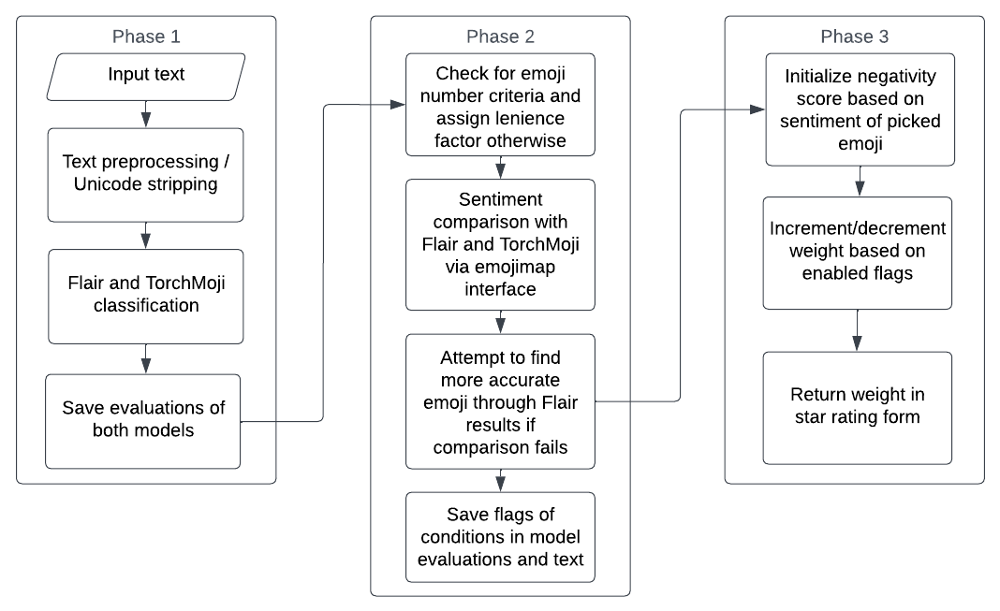
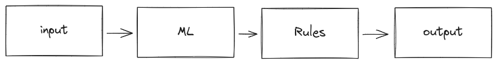

# Combining literal rules and machine learning

Currently, I am developing (or have developed?) [Wordsmyth](https://github.com/ajskateboarder/wordsmyth), a star rating prediction model designed to tackle the bias and incorrectness of the consumer star system through sentiment analysis and rules. This system allows you to use the pros of both rule-based systems:

- simple to build and interpret
- less computationally expensive
- high precision due to domain expertise

and machine learning:

- higher overall accuracy
- very dynamic
- easy to adapt to situations

With my project, I use the output of pre-trained sentiment analysis networks as inputs to a rule-based process to correct the outputs and quantify the sentiment information as a star rating using a weighting system.



In simpler terms, this is the layout of the system:



What's honestly weird about this approach is that, in this ever-growing ecosystem of machine learning, there are so few applications of this approach online!! Aside from the [few blogs](#related) I found that cover this idea, there are no projects to be found that apply a similar methodology; everybody is just talking about how nice the approach. So let me fix that - by reviewing code that applies this logic in action. Obviously, the code being reviewed will be domain-specific, but this post will stand for those who want to implement a ML -> rules system.

## Teeny-tiny code review

### Initialization/model prediction

```py
output = Output(
    sentiment=flair.predict(text),
    emojis=torchmoji.predict(text, emojis),
    text=text
)

rater = Rater(output)
```

Initially, the program passes the input data to a set of pretrained models which both predict various facets of emotion in the text. `flair` simply classifies text as either positive or negative, while `torchmoji` predicts ten emojis that match the sentiment of the text. This is then wrapped into a `dataclass` and passed into the main rule logic.

In the rule logic initialization, we get some information from the predictions and put it into, yes, another dataclass that passed around to the main steps:

```py
class Rater:
    def __init__(output):
        metadata = Evaluation(
            content=output.text,
            emoji=None,
            emojis=output.emojis,
            position=None,
            sentiment_flair=output.sentiment["sentiment"],
            score=output.sentiment["score"],
            ...
        )
        ...
```

### Rule 1. Resolving sentiment between models

The reasoning for this rule is that `flair` tends to be correct in objective sentiment, but is lacking any detailed sentiment, like specific emotions. To make up for this, we bring in `torchmoji`, an emoji prediction model, but it seems to make a lot more false predictions than `flair`, so this rule is used to help `torchmoji` choose a better prediction based on `flair` while having detailed sentiment.

<small>This rule is so painfully written and I am so close to just rewriting it all.</small>

In the first of three phases involved, the first phase attempts to fix false-negatives/positives in the emoji using some.. expert knowledge, I guess?

```py
m = self.metadata

target_emojis = [
    ":confused:", ":thumbsup:", 
    ":eyes:", ":smile:",
    ":persevere:",
]
emoji_indices = self.find_indices(output.emojis, target_emojis)

if not emoji_indices:
    return

m.sentiment_emoji = (
    emojimap[output.emojis[min(emoji_indices)]]
)["sentiment"]
```

Here, the rule assumes that `output.emojis` should contain any emojis from a list of emojis that often show up in `torchmohi` responses, `target_emojis`. If none exist, the rules fail immediately so the next steps don't produce any weird results. 

If at least one exists, the rule can continue on to set the sentiment provided by the most accurate emoji predicted by `torchmoji` among the ten that were predicted. This can be determined by:

- finding the list indices of each target emoji in `output.emojis`
- creating a list from that information
- and picking the item from that list closest to index 0  

We can find the precise sentiment of that emoji by looking up the emoji in the `emojimap` dictionary, a dedicated resource which maps emojis to sentiment. 

```py
if m.sentiment_flair != m.sentiment_emoji:
    matching = [
        e
        for e in output.emojis
        if emojimap[e]["sentiment"] == m.sentiment_flair
        and emojimap[e]["repr"] in m.emojis
    ]
    
    sequence = [m.emojis.index(emojimap[e]["repr"]) for e in matching]  
    closest_index = min(sequence) if sequence else None

    # FIXME: this .get() and if-else stuff sucks v
    fixed_emoji = (
        emojimap.get(m.emojis[closest_index], {})
        if closest_index is not None
        else {}
    )

    if m.sentiment_flair == fixed_emoji.get("sentiment"):
        m.fixed_emoji = fixed_emoji.get("repr")
        # TODO: supposed to return here
```

If the sentiment of `flair` and the chosen emoji do not match, we attempt to find emojis in the entire `emojimap` that match `flair`'s sentiment. After this, we essentially apply the same process as before to pick a more correct emoji to represent `torchmoji`'s sentiment. I'm pretty sure the rule is supposed to finish if the sentiment finally matches, but it doesn't??

```py
    # still in the if block
    if (
        [e["sentiment"] == "pos" for e in matching_emojis].count(True)
    ) > (
        [e["sentiment"] == "neg" for e in matching_emojis].count(True)
    ):
        m.sentiment_map = "pos"
    else:
        m.sentiment_map = "neg"
```

The rest of this rule is basically fallback behavior if the sentiment still does not match. This portion uses a super basic assumption to pick a sentiment if it still doesn't match: if more emojis are negative than positive, the sentiment is (likely) negative, and if not, it's (likely) positive.

```py
    target_emojis.remove(m.emoji)

    try:
        m.fixed_emoji = emojimap[
            [
                e
                for e in m.emojis
                if emojimap[e]["sentiment"] == m.sentiment_flair
            ][0]
        ]["repr"]
    except IndexError:
        m.status = "incorrect"
        # TODO: also supposed to return here

    m.status = "fixed"
    # TODO: also supposed to return here? lol??

m.status = "correct"
```

In addition to choosing better sentiment, this part attempts to choose a better emoji by choosing the first emoji from the entire `emojimap` that matches with `flair`'s sentiment. 

If it fails once again, which is thankfully quite rare, the rule system just calls it a day and gives a note that the results of the next rules may yield incorrect results.

### Rule 2. Flagging

A much easier rule system to interpret

## Related

- https://kislayverma.com/programming/combining-rule-systems-and-machine-learning/
- https://nlathia.github.io/2020/10/ML-and-rule-engines.html
- https://www.capitalone.com/tech/machine-learning/rules-vs-machine-learning - Specifically the "Patterns for Using Machine Learning and Rules Engines Together" section
- https://github.com/conaticus/ebay-account-summarizer - applies similar flagging and scoring system to the one used here (see [server/src/sellerRater.ts](https://github.com/conaticus/ebay-account-summarizer/blob/master/server/src/sellerRater.ts))