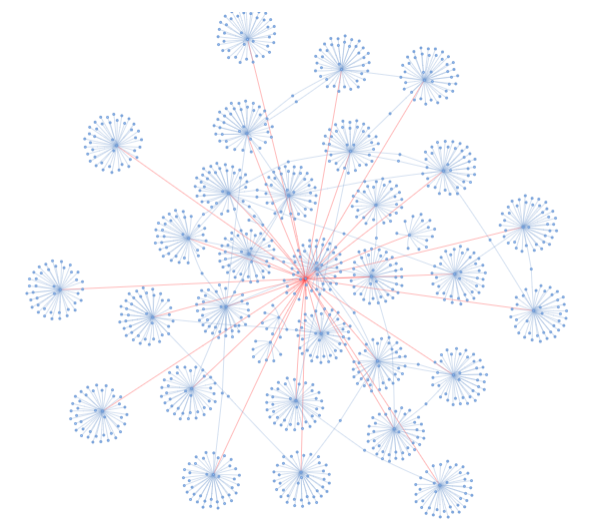
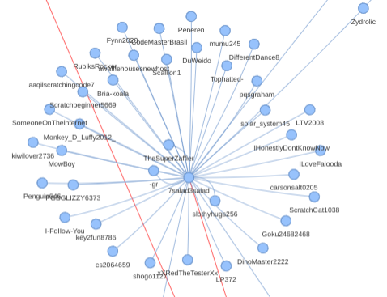

# A network analysis of the Scratch community

<figure>
  
  <figcaption>Snippet of follower graph</figcaption>
</figure>

<kbd>python</kbd> <kbd>graph-theory</kbd> <kbd>social-networks</kbd>

Because why not? Scratch sure doesn't have a lot of analysis projects for the size of its community, let alone any graph analyses it seems. Also I thought it was cool to see what silly topics I could infer people like from followers -- in other words, seeing what's cool with the 8 year olds. If you've never thought of the follow system as a friendship system or if you've [never thought of Scratch as a social media](https://ocular.jeffalo.net/search?q=scratch%20is%20not%20a%20social%20media%20%2Bcategory%3A%22Suggestions%22&sort=relevance), this visualization couldn't make these qualifications any less obvious. Aside from visualizations, we could also have a basic follower recommendation system using this approach.

The source code for this is available on GitHub, as usual: [https://github.com/ajskateboarder/ajskateboarder.github.io/blob/main/scratch-net-analysis/net.py](https://github.com/ajskateboarder/ajskateboarder.github.io/blob/main/scratch-net-analysis/net.py) (didn't really need its own repo since it was pretty small)

For my analysis, I use Python, [NetworkX](https://networkx.org/) to construct the network, and [PyVis](https://pyvis.readthedocs.io/) to create interactive visualizations of the networks (lesson learned, do not use matplotlib for graphs with over 30 nodes). And of course, I use the [requests](https://requests.readthedocs.io/en/latest/) library for accessing Scratch's API for [aggregate follower data](https://towerofnix.github.io/scratch-api-unofficial-docs/api/users.html).

## Review

I made the following functions to collect follower and following data:

```py
def get_some_followers(user, pages):
    followers = []
    offset, page = 40, 1
    r = requests.get(f"https://api.scratch.mit.edu/users/{user}/followers")
    r.raise_for_status()
    while r.json():
        if page >= pages:
            break
        r = requests.get(
            f"https://api.scratch.mit.edu/users/{user}/followers",
            params={"limit": "40", "offset": offset},
        )
        r.raise_for_status()
        followers.extend(r.json())
        offset += 40
        page += 1
    return followers
```

```py
def get_following(user):
    following = []
    offset = 40
    r = requests.get(f"https://api.scratch.mit.edu/users/{user}/following")
    r.raise_for_status()
    while r.json():
        r = requests.get(
            f"https://api.scratch.mit.edu/users/{user}/following",
            params={"limit": "40", "offset": offset},
        )
        r.raise_for_status()
        following.extend(r.json())
        offset += 40
    return following
```

I first tested it out on my own followers. This is done in the script by fetching the first 80 of my followers:

```py
G = nx.Graph()
followers = get_some_followers("ajskateboarder", 2)
edges = [
    ("ajskateboarder", user)
    for follower in followers
    if (user := follower["username"])
    if user != "ajskateboarder"
]
G.add_edges_from(edges, color="red")
```

These are the root followers of the graph. I mark these followers red so that I can easily find them in the final visualization. Then I fetch at most the first 80 of each of their followers:

```py
for _, username in edges:
    followers = get_some_followers(username, 2)
    edges = [
        (username, user)
        for follower in followers
        if (user := follower["username"])
        if user != username
    ]
    G.add_edges_from(edges)
    time.sleep(0.4)
```

I could repeat this for much longer if I wanted to (without it turning into API abuse obviously 🤣), but for demo purposes, I stop after a single time of doing this... nevertheless, it's still a very huge network. Root followers have their own followers, which can essentially be considered communities. Users that have common followers will connect with common communities.



Since I am unfortunately a yapping forumer, I have quite a few forumers and people that noticed me in the forums following me... at least it's better than noone following me.

One example is @7salad3salad, a user with probably thousands of posts who also has many followers which happen to be well-known forumers (consider this a shoutout salad). Nearly everyone in Salad's community are either forumers or people that have received help from Salad. 



Here, you can notice how root followers have their own personalities as spotted by the followers that follow root followers.


There are a few known type of usernames on Scratch: the miscellaneous ones, ones involving any animal, and the "aesthetic" ones. From what I've seen on other social media, no other platform has these silly aesthetic usernames in such abundance. They usually consist of replacing vowels with "x", using extra vowels (usually i), and/or using extra dashes. Usually, it doesn't even take a *single step* to reach a follower that meets these qualifications.

[todo..]

The full networks for both networks can be found at below links:

- [@ajskateboarder (me)](./me.html)
- [@griffpatch](./griffpatch.html)

## Things to do

I'll update the blog later with these things

- Set size of user nodes based on number of followers
- Measure number of steps to reach certain profiles
- Keyword stuff with user descriptions to topic model communities

## Check out

- https://awesome-llama.github.io/articles/statistics
