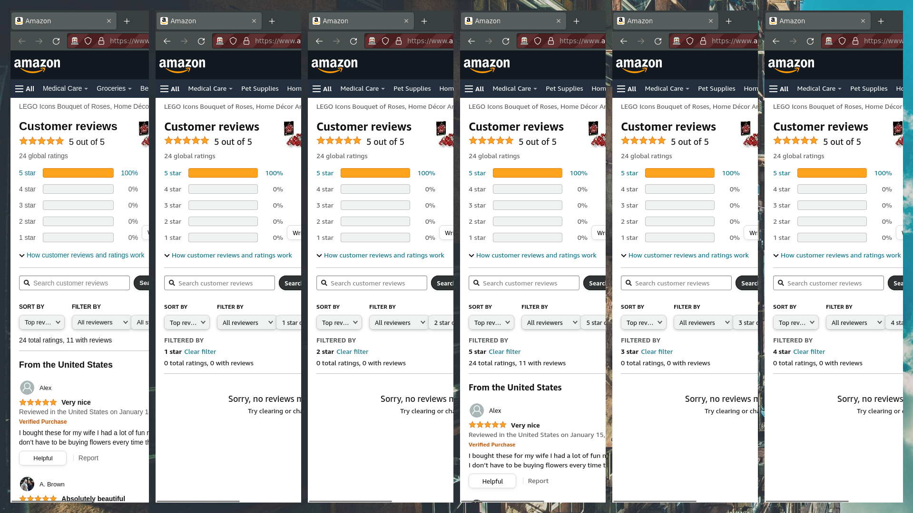

# Building a distributed web scraper

<figure>
  
  <figcaption>Distributed web scraping process</figcaption>
</figure>

**Tags:** <kbd>python</kbd> <kbd>selenium</kbd> <kbd>web-scraping</kbd> <kbd>ecommerce</kbd>

wip
