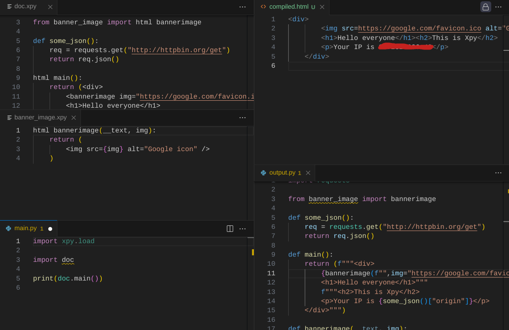

# Attempts to make a Python templating system that isn't bad



<sub>This is one of my first ever blog posts on software -- if I ever sound verbose, apologies in advance :P</sub>

The source code for this is available on GitHub: https://github.com/ajskateboarder/xpy

Templating, mainly with HTML, in Python is a very common thing to do when serving up dynamic content on a server or building static files, documentation, or reports. Even with the prevalence of JavaScript frameworks, sites sometimes use templates to inject data into the page to be rendered on the frontend; YouTube is a popular example.

There exists many [languages to build templates in Python](https://www.fullstackpython.com/template-engines.html) alone... yet they all suck at scale. There exist so many pitfalls in trying to build something even remotely functional without having to muck around with things like blocks, macros, function injection, etc, and these all *only* exist because they are seperate from Python.

...

So instead of bringing Python to templating languages, we do the exact opposite, and bring templating languages right into Python!!

I'm going to mention that this obviously wasn't meant to compete with templating languages; those sorts of languages are far more stable than whatever this nonsense is (I don't even intend to use this ever). I mainly built this to see how far I could go with bringing JSX-like templates to Python itself. I *was* thinking of integrating this into Spylt, but that has a far different goal which I don't want to mess with, that being to integrate Svelte and Python with a very simple interface.

(tl;dr: this was mostly for the lolz, don't use in production)

This idea was inspired by Ben Visness's [LuaX](https://bvisness.me/luax/) that he built for his personal site, which integrates Go business logic with Lua and supports JSX-like code. This is also pretty similar to [packed](https://github.com/michaeljones/packed), but I wanted to include some more features and parse things differently.

## How the thing works

Xpy uses a type of preprocessor, mainly because I was too lazy to write new grammar for Python. But don't worry, I made it better in ways I'll explain soon. 

When I first started, I decided to use a while loop to iterate over lines, which was questionable at best:

```py
line_index = 0
while line_index < len(code.readlines()):
    if regx.ELEMENT.match(line):
        # ...what if this element spans multiple lines??
    line_index += 1
```

The logic for that turned into a cryptic puzzle of ~150 lines, which didn't even account for most element usages. It also had an arbitrary restriction that elements can only be used at return.

With a rewrite I finished in about four hours of straight staring at a screen, it simply uses regular expressions on the source code to find and replace stuff. This also reduced the parser to ~52 lines, so if you ever want to preprocess some code, just put your fate in the hands of Regex or a lexer/parser and not a stupid central loop.

References to blocks with any type of element are converted into triple-quoted f-strings. Then the parser goes back and converts custom-defined elements into calls inside braces, like `{element("some_text", foo="bar", fizz=42)}`.

Since all elements are and return plain strings, you can do whatever you want to them, like applying functions or list comprehensions on them, multiplying them with the `*` operator, or even using string indices if you wanted.

> Something I don't really understand why I did while making this parser is converting plain HTML elements into string *literals*. Not even function calls like `create_element("a", href="https://google.com")`, just literals as you would see in your source code. Hmmm, I'll just call it a "design philosophy" for now while I work on that.

Now here's the part where it gets cooler. Xpy also takes advantage of import hooks to convert any code that you import on the fly. No build step or junk files!!

Let me give an example similar to the one shown in the banner:

```py
# cpg.xpy

# __text is a required argument, even for functions
# that don't need them. don't ask
html color_paragraph(__text, color):
    # parentheses are optional
    return (
        <p style="color: {color}">
            <h1>I have something very cool to say:</h1>
            {__text}
        </p>
    )
```

We define a small utility element so we don't need to make all of these silly colored paragraphs in our main code. As you would find in other JavaScript UI libraries, you insert data with braces. Obviously, you don't have to put every component in its own file.

```py
# doc.xpy

# yes, you need to let xpy know you're
# importing an element with "html"
from cpg import html color_paragraph

html main(__text):
    return (
        <color_paragraph color="red">
            Hello world!!!
        </color_paragraph>
    )
```

Then we write a small web app to host the HTML produced by `doc.main`:

```py
# main.py

# intentional side-effect to load all nearby xpys
import xpy.load
from flask import Flask

from doc import main

app = Flask(__name__)

@app.get("/")
def root():
    return main()
```

If we run our app and access the root page, we should expect our HTML to produce a red "Hello world!!!" Or at least that's what I think it should produce (it's very broken)

## The takeaways

This was mostly a fun process to write, but I mostly regret the way I implemented the parser; it's quite broken.

if you actually want more stable options, I recommend that you just use JSX with JavaScript and Babel (or a similar tool), or [typed_html](https://docs.rs/typed-html/latest/typed_html/) if you are using Rust.
